# Типи графіків. Як вибрати вірний графік для різних задач

Графіки дозволяють ефективно показувати різноманітні зв"язки, відношення між різними атрибутами (змінними)  у наших даних
 вони надають характерну візуальну форму для кожного типу зв"язку. Корисно розуміти, які типи графіків можуть бути застосовані для різних типів зв"язків. Є декілька таких типів 
* Еволюція в часі 
* Ранжування 
* Співвідношення частки і цілого 
* Відхилення 
* Розподіл 
* Кореляція 
* Географічні дані 
* Номінальне порівняння 

Згадаємо, які візуальні мітки використовуються для кодування даних на графіках
* точки
* лінії
* горизонтальні та вертикальні стовпці
* горизонтальні та вертикальні бокси (про них трохи пізніше)

Для визначення, який саме тип нам потрібно показати (тобто який графік вибрати), потрібно пошукати в описі задачі ключові слова, за якими можна визначити тип зв"язку (С. Фью)):

### Номінальне порівняння 
(серія невпорядкованих дискретних кількісних значень - найпростіший тип зв"язку. )

Ми просто маємо показати серію дискретних кількісних значень- кожна з яких відноситься до своєї категорії, щоб порівняти їх відносний розмір. Наші змінні - категорійна і кількісна, кодуємо їх як позицію. Хорошими варіантами мають бути стовпчикові графіки (вертикальні, або горизонтальні) або точкові графіки. (((fig_01_01))) 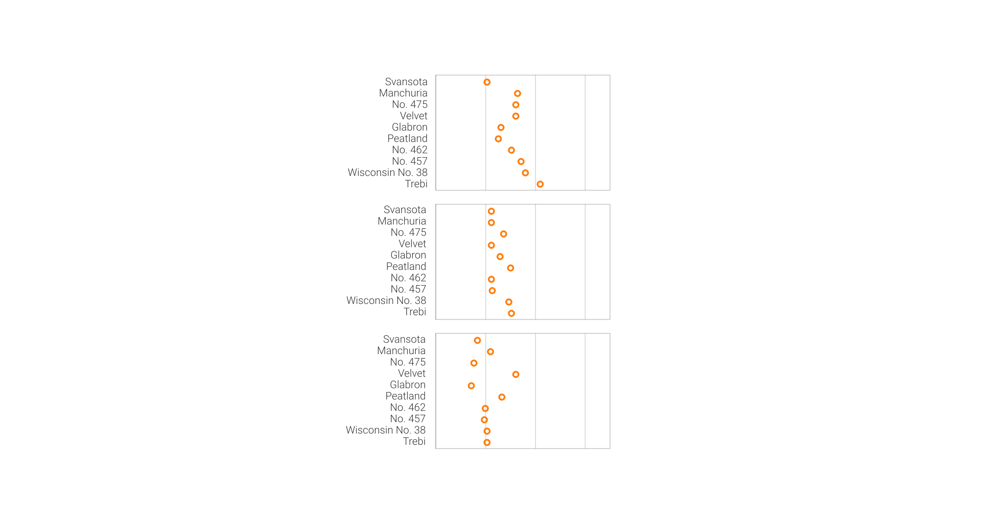
Особливість - точкові графіки можуть починатися не від нульового значення, а стовпчикові - лище з нуля (чому? - тому що ствопчик - це кодування за допомогою довжини, її повинно бути видно всю. Точка - це позиція)

### Еволюція в часі 
(тренд, зміна, зростання(падіння), збільшення(змен.), підвищення(пониж.), коливання(флуктуація))  ((fig_01_02)) 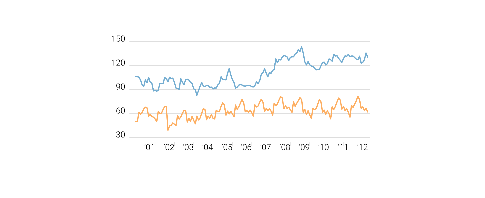

Змінні - впорядкована(час) та кількісна. Кодуємо позицією. ЛІнійний графік - перший вибір. Також, вертикальні стовпчики  (((fig_01_03))) - (не горизонтальні, в яких час йже по вертикалі). Чому? Тому що ми показуємо значення впродовж (довжина, не висота!) якогось часу - у нас присутня сильна культурна традиція читати зліва направо (відповідно, умовний напрямок часу - по горизонталі). Не показуємо по вертикалі такі графіки. Точковий графік погано піходить, тому що точки гірше показують зв"язок між сусідніми часовими інтервалами.  
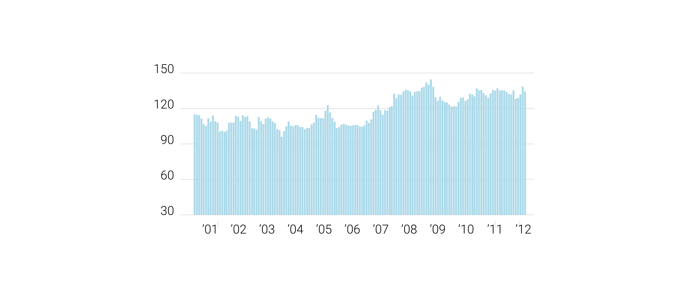

### Ранжування 
(більше(менше) ніж, дорівнює )

Те ж саме, що номінальне порівняння, однак обов"язково використовуємо сортування! У порядку зменщення, або навпаки - в залежності що саме хочимо показати (((fig_01_04)))
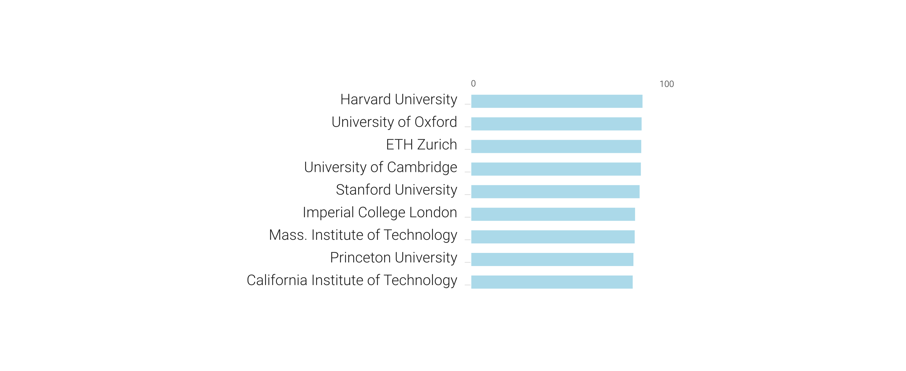

### Співвідношення частки і цілого 
(відношення, відсоток, частка)

Ми натреновані розуміти частку як відсоток.
Наші змінні - це категорії(частки цілого), та їх внесок у ціле. Кодування може бути колір для категорій та довжина для значень часток, виходить складена стовпчикова діаграма (((fig_01_05)))
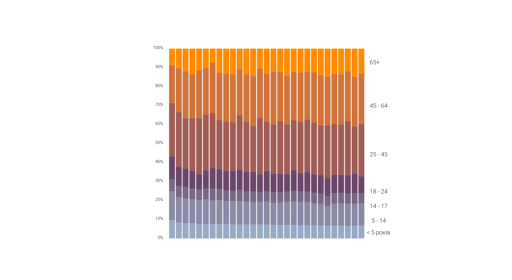
Це лише трохи краще ніж млинці. Кращим варіантом буде позиція-позиція(довжина) - коли ми розберем складені фрагменти і відсортуємо їх (((fig_01_06))) Зверніть увагу що стовпчики разом складають 100%, і в підпису йдеться про відсотки
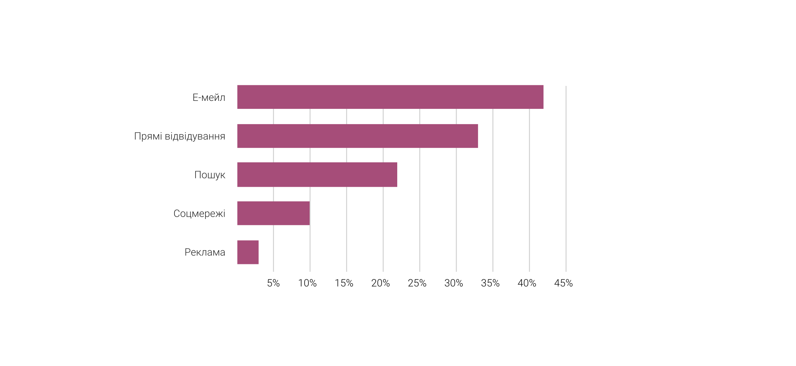

### Відхилення 
(плюс або мінус, варіація(відхилення), різниця, порівнюючи з )

Знов маємо кількість і категорію в даних, знову використовуємо позицію для кодування. 
Перший варіант - парні стовпчики (((fig_01_07))), 
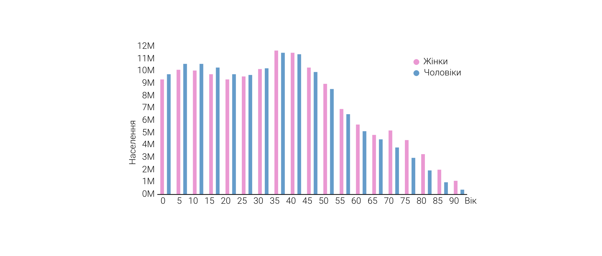
однак якщо цікаво лище різниця, то варто її і показувати, і підкреслити кольором. Інший варіант - використати різницю у відсотках, для того щоб об"єктивно оцінити відхидення для різних категорій.
Для відхилення у часі використовують лінійний графік з різницею між показниками.

### Розподіл 
(частота, розподіл, концентрація, нормальний розподіл(крива Гауса, крива Белла))

Графік розподілу показує, наскільки часто значення кількісної змінної зустрічаються вздовж всього діапазону своїх значень, від найменшого до набільшого. 
Зазвичай, весь цей діапазон розбивається на рівні інтервали (номер такого інтервала - це змінна впорядкованого типу даних), і для кожного інтервалу рахується скільки разів або який відсоток кількісна змінна потрапила в цей інтервал. 
Гістограма найчастіше використовується для такої задачі (((fig_01_09))). 
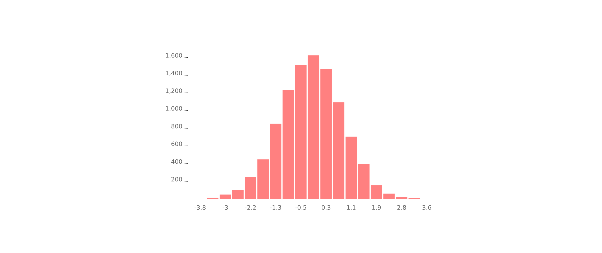
Кумулятивна частота - теж корисний графік, для того щоб швидко рахувати внесок декількох діапазонів 
Ефективним способом показати всі значення є "точкова гістограма", в якій кожна точка є одним значенням змінної, що потрапила у відповідний інтервал (((fig_01_11)))
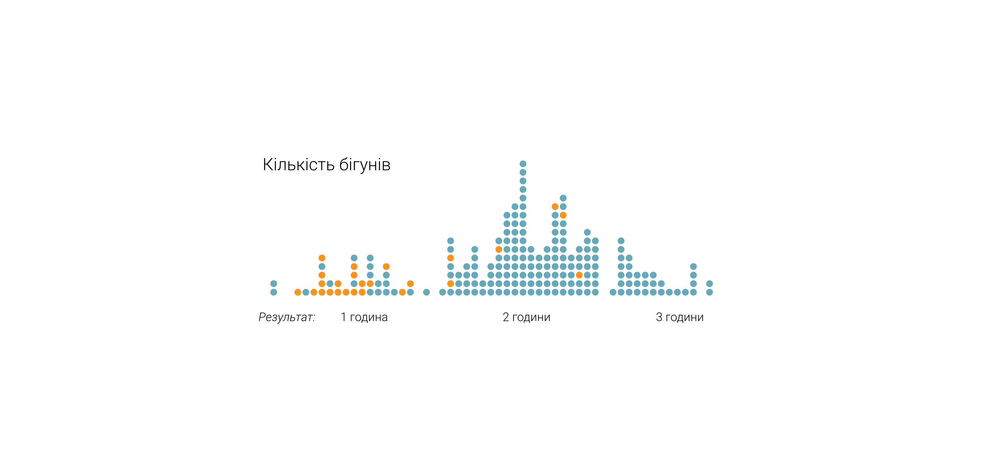

Спорідненим графіком також є "бджолиний рій" ["beeswarm plot"](http://www.cbs.dtu.dk/~eklund/beeswarm/) (((fig_01_12)))
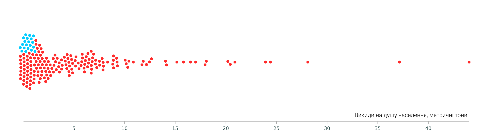

Смужкова діаграма використовує прозорість щоб показати скупчення в тому чи іншому інтервалі (((fig_01_12bis))) - як у цій роботі WP. 
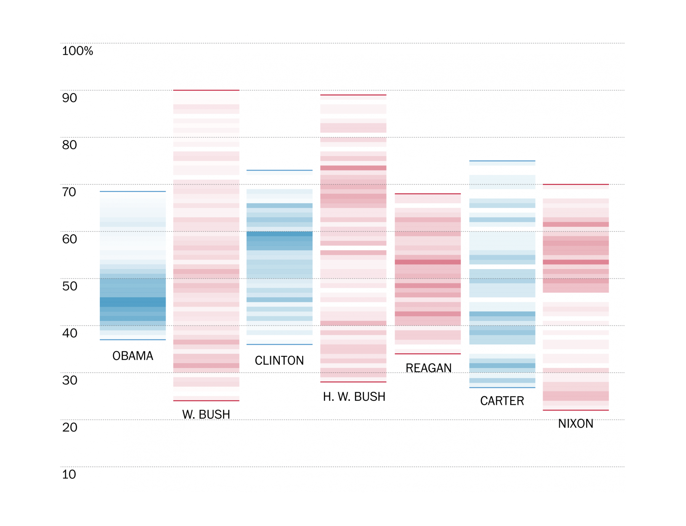
Цей трюк з прозорістю часто використовують на точкових xy-графіках та на картах. 

Багато розподілів - показують за допомогою лінійний частотних полігонів, або бокс - графіків. Бокс дозволяє показати одразу розмах значень, найбільше і найменше значення конкретного розподілу, медіану та діапазон куди потрапляє 50 відсотків усіх значень (і відповідно 25 та 75 процентилі) (((fig_01_13)))
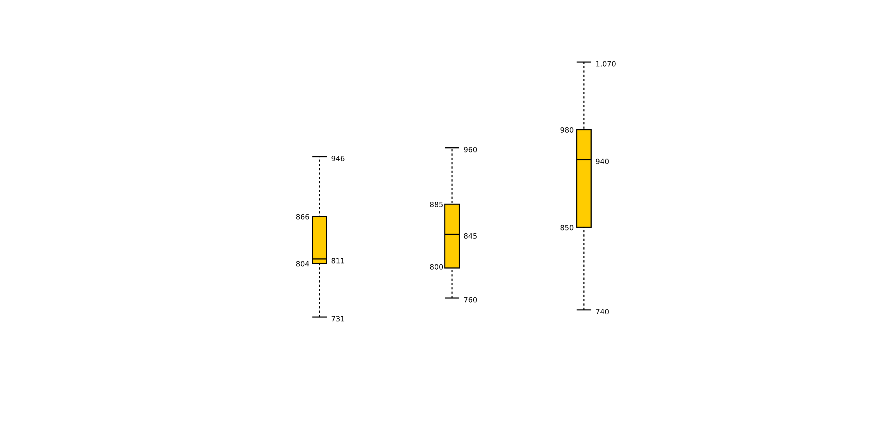
Бокс- графік напевне один із найбільш ефективних способів показати одразу багато розподілів різних величин на одному листку

### Кореляція 
(зростає з, падає з, змінюється з, викликане, причина якого, слідує за)

Щоб показати зв"язок між парами кількісних змінних (позиція-позиція = xy-точковий графік)(((fig_01_14)))

якщо позиція(для номінальнох категорії) + довжина(знач 1) + довжина(знач 2) = використовуємо вже знайомий нам парний стовпчиковий гарфік (((fig_01_07)))

### Географічні дані (географія, локація(позиція), де розташоване, регіон, територія, країна, місто, область тощо)
проблема - два найкращих способи кодування, які ми використовували весь час, зайняті для карти (xy та довжина із спільною базою). Залишається розмір, інтенсивність кольору та ширина для кількісних даних, хоча вони не такі точні.

- точки різного розміру (((fig_01_15))) 
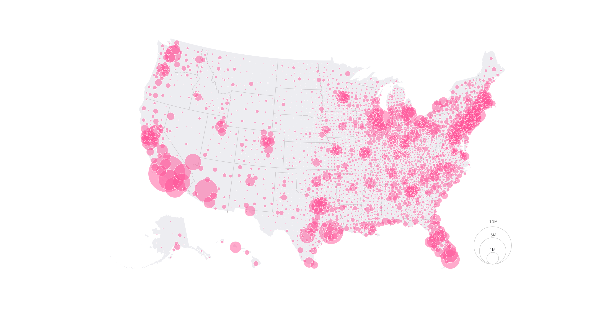

- інт. колір для різних гео-регіонів(((fig_01_16)))

- лінії різної ширини або інт. кольору(((fig_01_17))) - укрзалізниця, Харків 

Детальніше про карти поговоримо в одній із наступних лекцій.
Дякую за увагу

***

Для ілюстрацій використані роботи Washington Post, SCMP, Майка Бостока та інших авторів
