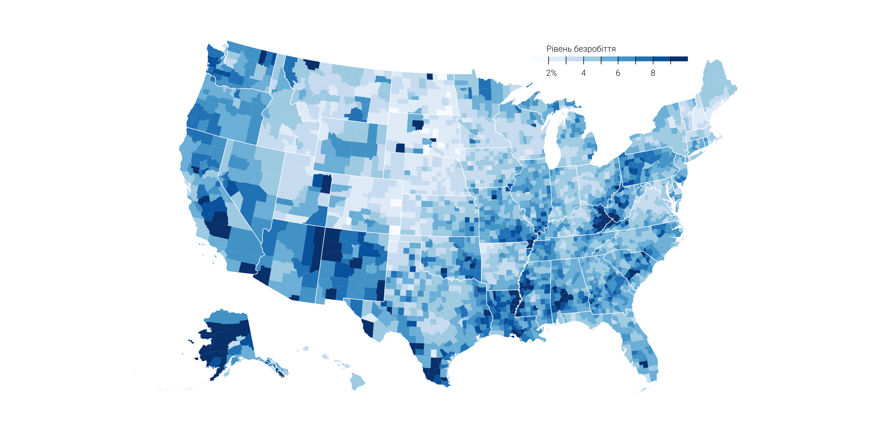
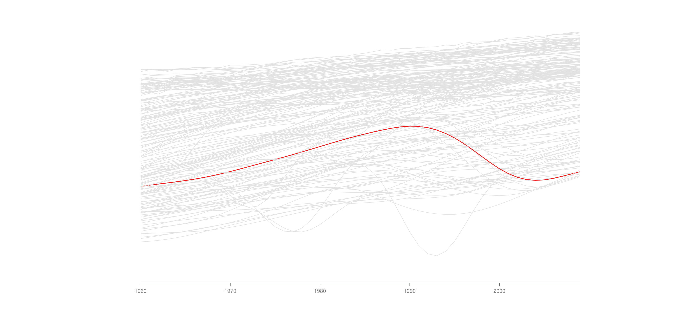
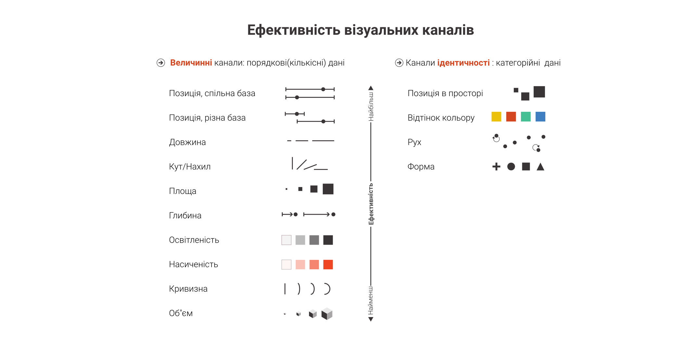
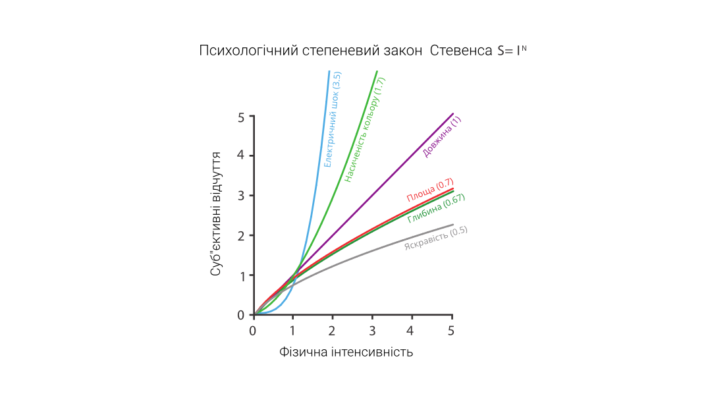
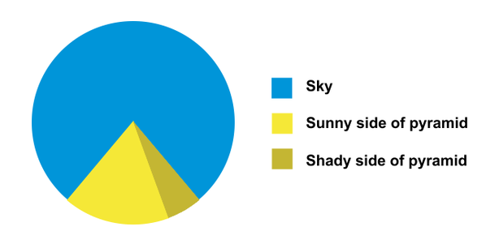
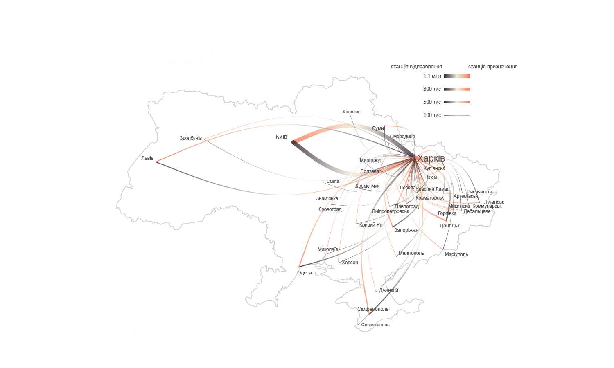
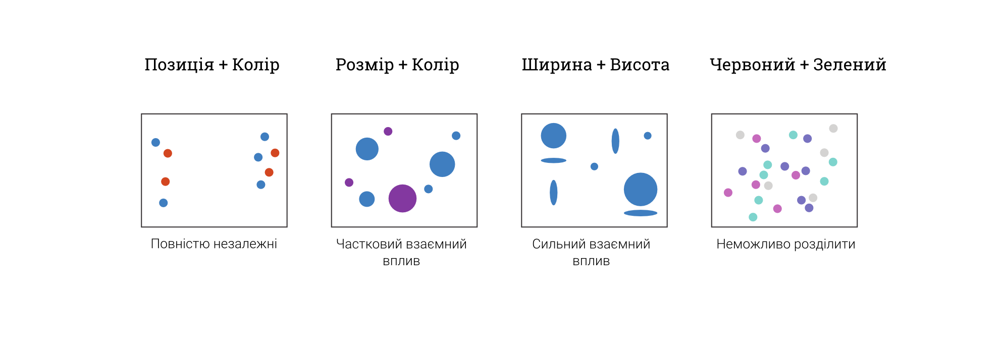
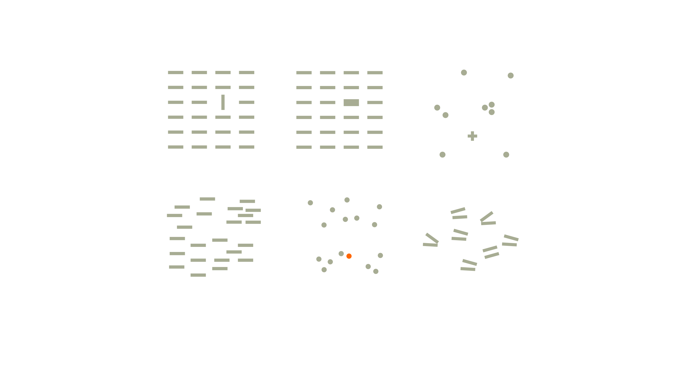
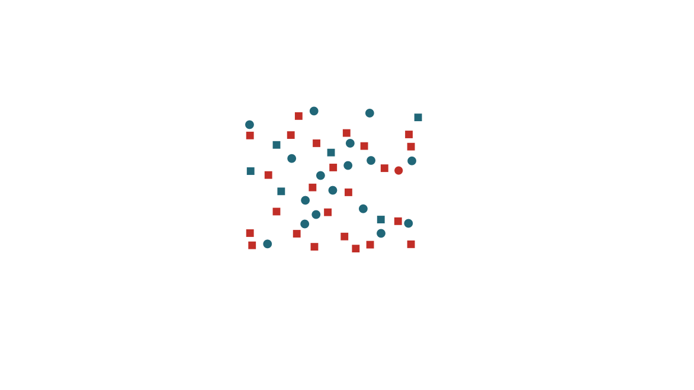
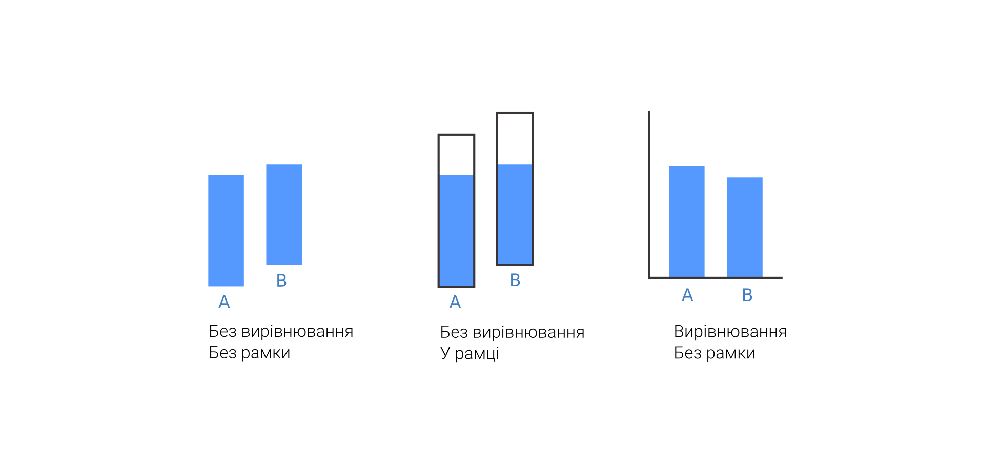

# Частина 2
### Ефективність кодування

Нагадаю, що минулого разу ми говорили про мову: мітки, візуальні канали  а також що для різних типів даних потрібно використовувати відповідні візуальні канали. Найкритичніше - категорійні, невпорядковані дані потрібно показувати за допомогою візуального кодування, що зберігає відмінність - наприклад, різні кольори або різна геометрична форма. Впорядковані (та кількісні) дані потрібно показувати так, щоб наша візуальна система могла визначити порядок - наприклад, якщо у якості каналу задіяний колір, тоді це має бути або перехід від кольору до сірого(знебарвлення, десатурація), або однаковий колір з різними інтенсивностями, а не різні кольори.(((приклад карти)))    

З іншого боку, різні канали навіть якщо вони придатні - не однаково ефективні. Тому необхідно використовувати принцип - '''за допомогою найбільш видимого (сильного) каналу порібно кодувати найголовнішу інформацію''' (атрибут в даних). Як визначити найголовнішу інформацію ми трохи говорили на початку курсу, і детальніше поговоримо пізніше. Іншими словами - більш важливі змінні (атрибути) у ваших даних повинні кодуватися більш ефективними, набільш помітними каналами. Менш важливі - менш ефективними. Напевне, це найбільш важлививй принцип інформаційного дизайну. Зверніть увагу, що найбільш важлива лінія показана найпомітнішим кольором (((Приклад - лінійний графік з багатьма лініями)))  

Тепер детальніше поговоримо про те, що таке ефективність в контексті візуального кодування. Розглянемо 4 компоненти: акуратність, здатність розрізнити варіанти, незалежність та поп-ап (pop-up) ефект

### 1. акуратність представлення

 

Звідки ми взяли цей рейтинг? 

Наприклад, з наступного експериментального спостереження. Фізіологічний стимул практично завжди викликає нелінійний відгук (суб"єктивні відчуття перебільшені для одних впливів та недооцінені для інших):
  

Стимул|Експонента|Умови
---|---|---
Звук| 	0.67 | Тиск від 3000-Hz сигналу
Вібрація|0.95| частота 60 Hz на палець
Вібрація|0.6|частота 250 Hz на палець
Яскравість|0.33|5° мішень в темряві
Яскравість|0.5|Точкове джерело
Яскравість|5|Короткий спалах
Яскравість|1|Точкове джерело, короткий спалах
Освітленість|1.2|Альбедо сірого паперу 
Довжина| 1| Лінія
Площа|0.7|Квадрат
Насиченість|1.7|Перехід червоне-сіре
Смак|1.3|Сахароза
Електрошок|3.5|Ток через палець

Тому наприклад, площа - не дуже хороший спосіб показувати числові дані (а якже улюблені млинці? - використовуйте їх дуже обережно)

  

### 2. Здатність розрізнити варіанти
Чи може людина побачити відмінність атрибутів візуального каналу? Наприклад, товщина лінії - скільки варіантів товщини повинно бути, шоб ми все ще їх розрізняли між собою? (3, 5, 10? - (((карта))). Товщина лінії - дуже мала кількість інтервалів, які ми можемо розрізнити. Вибирай розумну обмежену кількість (3-4), або використовуй інший канал. Обмеження пов"язане з малою місткістю робочої пам"яті (нагадаю, одночасно не більше 3-4 об"єктів )
  

### 3. Ортогональність (незалежність) каналів

(Говоримо про пари каналів). Вони не є повністю незалежними і впливають один на одного. 
* Позиція + колір - незалкжні канали
* Розмір + колір - розмір впливає на відчуття кольору (на маленьких об/єктах його не видно)
* Горизонтальний розмір + вертикальний розмір (насправді, ми сприймаємо площу)
* червоний + зелений - повністю нероздільні канали, ми не можемо сказати скільки в кольорі точок червоного, а скільки зеленого (у нас по іншому працює обробка кольору)

### 4.Поп-аут - атрибут стрибає вам в очі (моментальне виявлення, паралельна обробка)

Багато каналів можуть забезпечити моментальне знаходження мітки серед інших міток (незалежно від їх кількості).
* колір
* орієнтація
* розмір
* форма
* близкість
* __Немає поп-ауту__: паралелизм ліній

#### 4.1 Поп-аут для пар каналів

Пари - більшість комбінацій каналів не дозволяють створювати поп-аут. Однак простір + колір та рух + форма дозволяють. Інші перетворюють паралельний пошук в послідовний, тобто значно повільніший (як на ілюстрації це відбулося з парою "Форма + колір" - ми не можемо одразу знайти червоне коло, треба перебрати багато варіантів)
Три і чотири канали - немає поп-ауту взагалі. Правило - для поп-ауту розраховуйте лише на один канал.

Поп-аут найчастіше використовують для показу найбільш важливої із важливих атрибутів 

### Всі наші оцінки - відносні. 

- якщо (((намалювати невирівняні стовпчики))) = їх важко оцінити
- якщо додати фрейм одного рощміру - одразу легще (міряємо пусту частину стовпчика)
- краше вирівняти по лінії

особливо це по кольору видно і по інтенсивності

Сьогодні ми детально поговорили про ефективність візуального кодування. 
Нарешті в наступній лекції я розкажу декілька мнемонічних правил, які хоч і не в жодному сенсі догмою, однак допоможуть вам робити ваші візуалізації професійними та ефективними.

Мені хотілося би, що би ви заПам/ятали - найголовнішу інформацію порібно кодувати за допомогою найбільш сильного візуального каналу, у якому можна досягнути ефекту моментального виявлення ваших даних.    

***

Посилання
* [Класика - робота Клівленда та МакГіла](https://www.cs.ubc.ca/~tmm/courses/cpsc533c-04-spr/readings/cleveland.pdf)
* [Colin Ware](http://ccom.unh.edu/vislab/colin_ware.html)
* [Tamara Munzner](https://www.cs.ubc.ca/~tmm/)
* [Огляд майже всіх фундаментальних досліджень по темі](https://medium.com/@kennelliott/39-studies-about-human-perception-in-30-minutes-4728f9e31a73#.k1hq362io)
