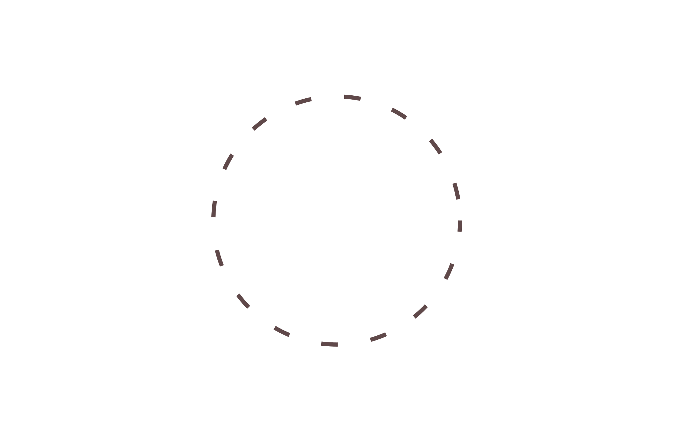
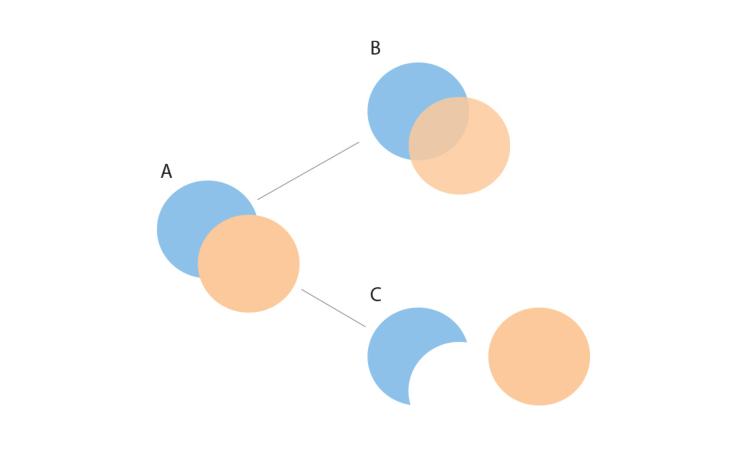
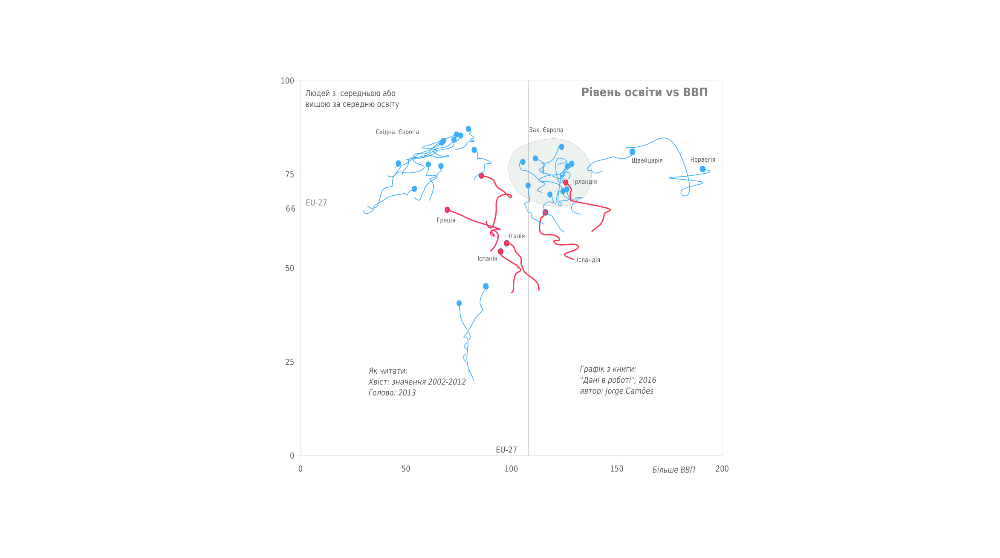
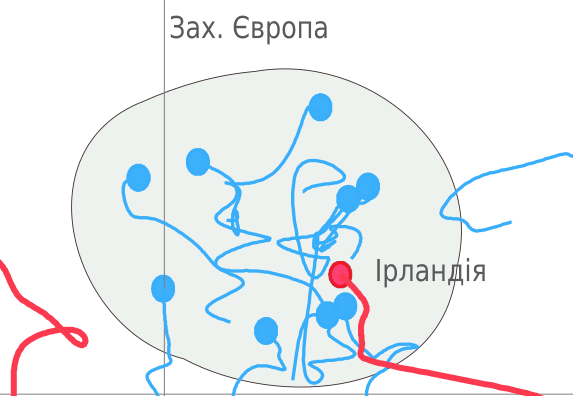
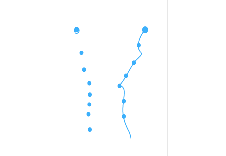
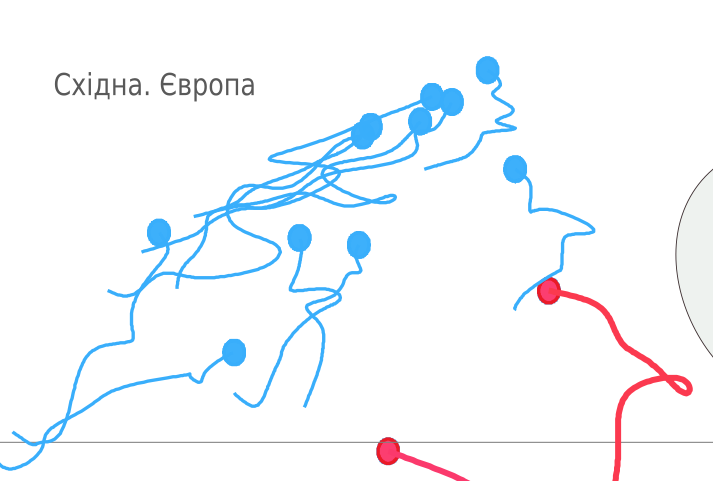
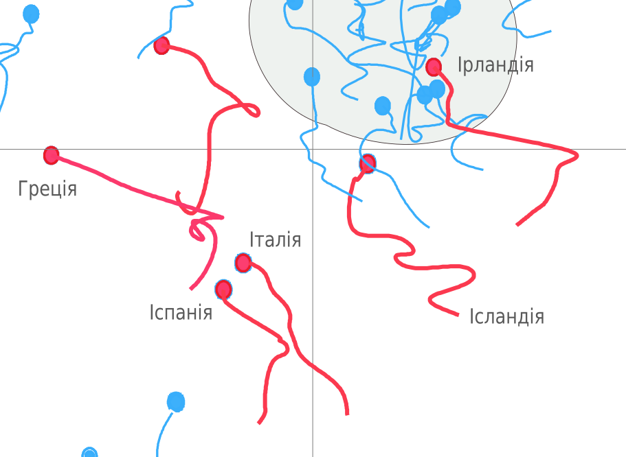
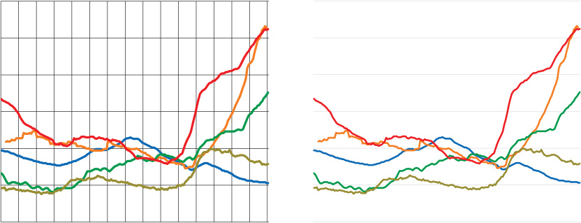
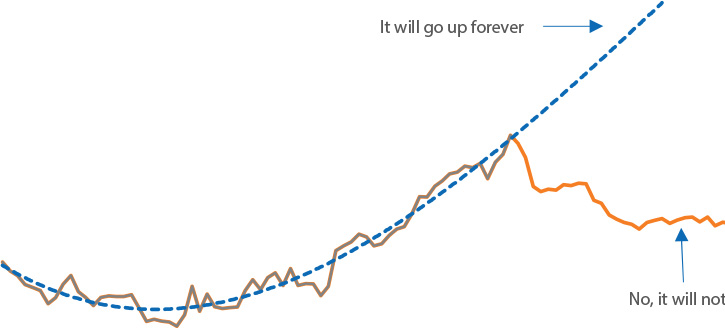
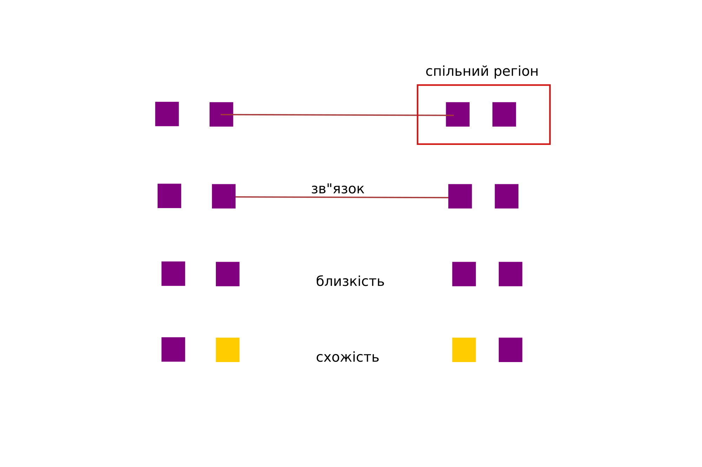

# Гештальт-принципи, та їх вплив на графічний дизайн

Наша задача - зрозуміти інформаційний дизайн. Коли ми з вами говорили про графічні мітки, про візуальні канали - ми говорили про найнижчий рівень абстракції. Сьогодні, ми поговоримо про  рівень вище - гештальт принципи сприйняття візуальної інформації, або про те, як наш мозок об"єднує базові візуальні позначки в групи. Відповідно, на наступних лекціях ми поговоримо про дизайн на ще більшому рівні абстракції - про такі речі, як баланс або ритм. Ось таким чином, знизу до верху, ми навчимось аналізувати будь яку візуальну композицію. 

Подивіться на картинку: більшість людей побачать в ній коло. Однак, це всього лише набір відрізків, не поєднаних один з одним. Їх об"єднує лише наш мозок.

Правила, за якими наш мозок групує, об"єднує та спрощує деталі та дозволяє еФективно сприймати загальну картину, називають "принципами гештальту". 

Вперше їх описали німецькі психологи в 20-х роках мнулого сторіччя. Підсумок їх досліжень: Загальна картина є більшою, ніж сума її окремих складових частин (і про"являється раніше, ніж деталі). Більше того, загальна картина простіша ніж сума окремих частин, принаймні мозок намагається бачити її простішою. Всі подальші принципи - результат наступного спостереження: __мозок постійно шукає шляхи спростити (об"єднати або згрупувати) те, що він бачить__. Мозок завжди прагне знайти "хорошу форму" у тому, що бачить.

Складні, багатоваріантні зображення ми будем сприймати у найпростіший спосіб - ми бачимо тут не серп і коло, а два кола, що перетинаються. Це базовий принцип - ми надаємо перевагу простим, зрозумілим і впорядкованим об"єктам - інстинктивно для нас це безпечні речі, вимагають менше часу на обробку і не містять неприємних сюрпризів (Звідси - ефективність таких речей як мдульна сітка, або віз. ієрархія).

Мозок спрощує та узагальнює, встановлює зв"язки між окремими елементами та зменшує значимість цих окремих елементів, і дозволяє зосередитися на загальній картині. В результаті, ми отримуємо більше корисної інформації, і зменшуємо кількість шума.

Чому Гештальт-принципи є такими важливими? Тому що, знаючи ці алгоритми сприйняття можна вивести основні засади сприйняття, на яких побудовано графічний дизайн.

Основні ідеї:
- проява "хорошої форми" (загальне йде раніше ніж деталі, ми усвідомлюємо спочатку загальну картину, бачимо те що психологи назвали "хорошою формою")(1)
- добудова (мозок створює картинку, не око - і добудовує неповну знайому форму до повноти) (2)
- мозок не любить невизначеності. завжди робочим є лише один варіант картини, бажано такий, для якого є пояснення (через це ми шукаємо закономірності навіть там, де їх немає (допомагає модульна сітка), тому в кадрі не можна міняти все одразу, а варто робити зміни логічними кроками) (3)
- інваріантність (ми впізнаєм базові об№єкти не залежно від розміру, зміщення, повороту) (4)

## Гештальт-принципи

Майже всі вони є наслідком наступного спостереження:  

    “При всіх рівних умовах елементи, що мають якусь спільну візуальну характеристику, 
    сприймаються як більш споріднені, ніж ті що не мають такої характеристики; 
    та об"єднуються нашим мозком в об"єкт на наступному рівні ієрархії.”
    — Stephen Palmer 

Більшість принципів нижче зформовані за цим правилом. У них йдеться або про зазначену спільну візуальну характеристику, або про об"єкт, в який їх об"єднує наш мозок. 
(Розберемо принципи на основі прикладу Хорхе Камоеша з книги "Дані в роботі")

#### Принципи гештальта, що пояснюють групування.
(список нижче наведений у порядку зменшення сили групування)

##### Спільний регіон

    “Елементи сприймаються як частина групи, якщо вони знаходяться у спільному замкненому регіоні.”

##### Зв"язки між елементами
На цьому принципі працюють, наприклад, лінійні графіки

    “Елементи, які у явному вигляді об"єднані візуально, більш сильно сприймаються як група, ніж ті, що не об"єднані”
    

##### Близькість

    “Об"єкти, що ближче один до одного, більш пов"язані (як група), ніж ті, що віддалені”

На цьому принципі базується, зокрема, сприйняття блоку у модульному дизайні як цілісної одиниці 

##### Схожість

    “Ми сприймаємо об"єкти, що мають спільну рису - колір, або розмір, або форму - як схожі та як 
    такі, що входять в одну групу”

На ілюстрації, червоні хвости об"єднують в одну групу декілька країн, хоча вони розташовані на відстані

##### Спільна доля(синхронізація, застосовується для рухомих об"єктів)

    “Елементи, що рухаються в спільному напрямку, сприймаються як більш пов"язані, ніж ті що стоять, або рухаються
    по іншому”
    

#### Більш абстрактні, ніж групування, принципи створення патернів

##### Замкнення 
У випадку, коли загальна картинка простіше, ніж частини, ми в першу чергу бачимо загальну картину

Як і в попередньому випадку, ми шукаємо простоти. Однак тут простіше добудувати (відомий нам) патерн, ніж розбиратися з окремими частинами.

##### Симетрія та порядок
    “Якщо є хоч наменша можливість, ми сприймаємо об"єкти як симетричні форми, що утворюються навколо центру”
Симетрія дає нам відчуття стабільності і порядку, які ми шукаємо. В нашій природі впроваджувати порядок в хаос (щоб зрозуміти). Здатність швидко знаходити симетрію та порядок варто використовувати щоб ефективно передавати інформацію

##### Фігура-Тло

    “Елементи сприймаються або як фігури(першого плану), або як тло.”

Чим більш чітко ми можемо визначити, де фігура, а де тло - тим краще ми зможемо спрямувати читача на те, на що треба дивитися. На практиці, а. з двох об"єктів що перетинаються, більш як фігура сприймається той, що менше, незалежно від кольору. б. Також, випуклі форми сприймаються як фігури, і навпаки, увігуті всередину, пласкі форми сприймаються як тло. 

Поки сітка має інтенсивний чорний колір (ліворуч), нам важко зрозуміти що вона насправді є тлом, тому графіки читаються важче. Якщо ми робимо її сірою, менш видимою, тоді стає зрозуміло, де тло, а де фігура (графіки)  

    
##### Продовження

    “Елементи, що розташовані на (уявній) лінії або кривій що плавно змінюється, сприймаються як більш пов"язані, ніж елементи не на лінії (кривій).”
 
Якщо ви починаєте дивитися або рухатися взовж якогось напрямку, ви продовжуєте це робити, поки не станеться щось дуже суттєве, що змінить ваше сприйняття

Цікаве застосування для графіків:

##### Фокусна точка

    “Елементи що виділяються серед інших, захоплюють та утримують увагу читача.”

Наша увага притягується до контрастних речей, до елементів що відрізняються (поп-аут ефект - частина цього принципу) 
Фокусна точка не буде працювати, якщо немає групи схожих елементів для контрасту.

### Підсумок
Ще раз, яке б зображення ви не використовували, мозок намагаєтьс його спростити. 

Найчастіше в інформаційному дизайні у явному вигляді гештальт-принципи використовуются для того, коли потрібно створити конкретні групи об"єктів. Проте, варто зважати на відносну силу кожного такого групування. Їх можна розташувати у такому порядку, від найсильнішого до найслабшого (точної наукової оцінки мені не доводилося бачити):

* спільний регіон
* зв"язки
* близькість
* схожість

* 
