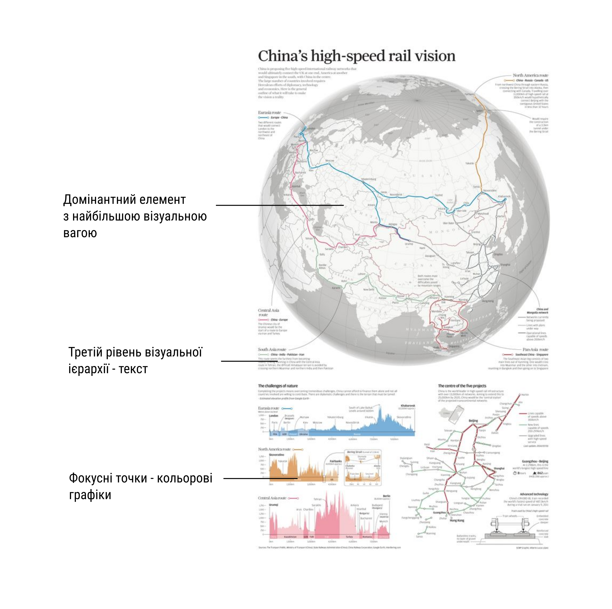
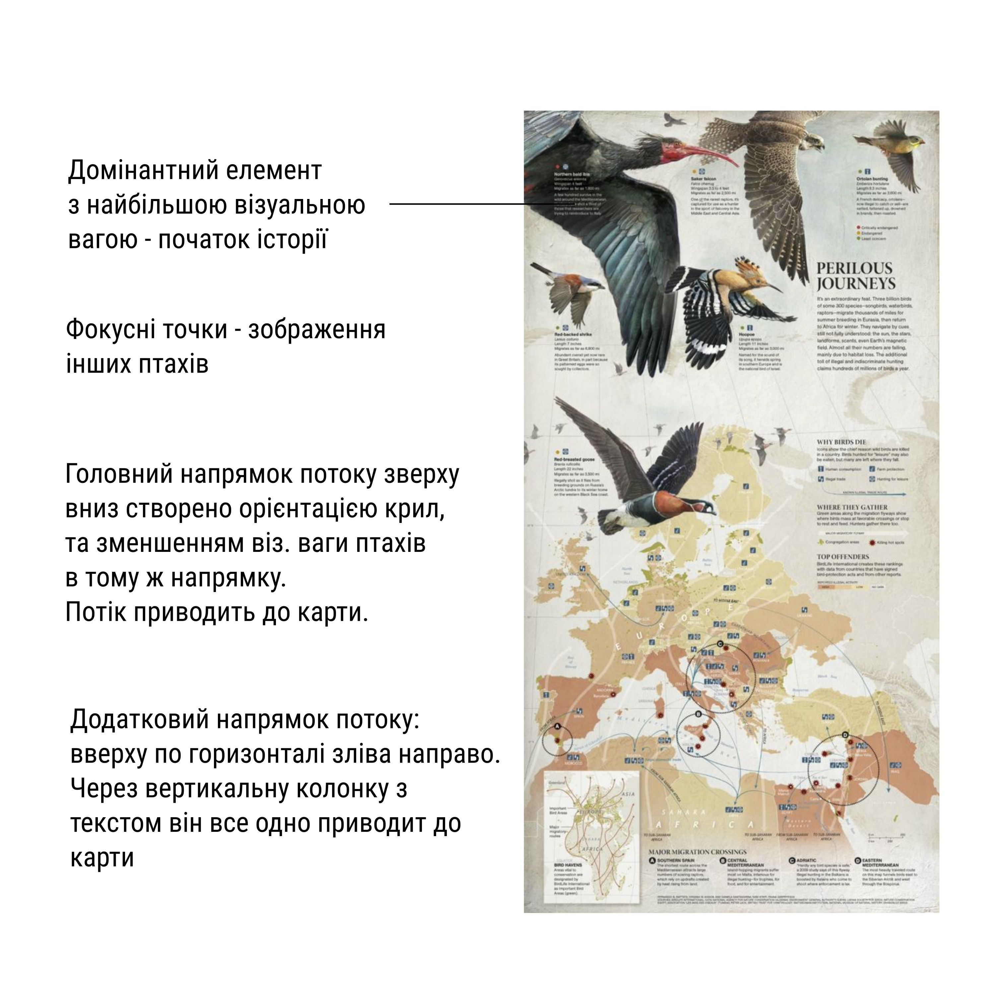
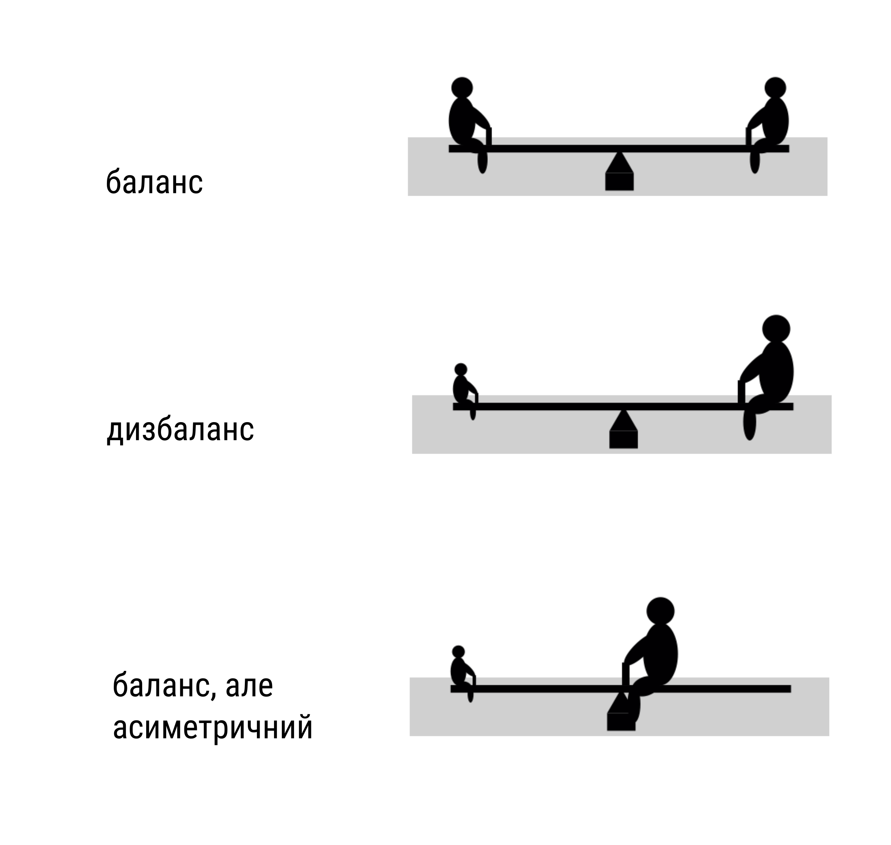

## Основні поняття графічного дизайну

Не забувайте про мнемонічні правила інфодизайну

### Простір 
- Негативний простір так само важливий, як і позитивні об"єкти. Білий простір такий саме активний елемент, як і бекграунд
- Він дає можливість дихати, робить шлях для очей - рухатись кріз ваш дизайн. Позитивні елементи можна побачити лище в 
контрасті з негативними. Без пустоти, у вас не буде дизайну, а буде шум: [поганий приклад - негативний простір практично відсутній](figures/week04/fig_design_01_spaceless.jpg)
- Простір може створювати контраст, підкреслювати та робити ієрархію: генерувати драму: забезпечувати відпочинок між групами
елементів
- Ви маєте простір лище тоді, коли у ньому щось є
- Простір корелює з якістю, довершеністю, вишуканістю, (порівняйте хай-енд та прості магазини) [хороший веб-магазин](figures/week04/fig_design_02_space.jpg)
- Ще одна важлива функція - підвищити розбірливість та читабельність тексту - мікроспейс робить більш розбірливим, макроспейс - більш читабельним

Не бійтеся викорситовувати простір! Дивіться як це [роблять інші](figures/week04/fig_design_021_space.jpg)

## Контраст: Схожість та відмінність

- Показати, що якісь елементи - схожі, а якісь - відмінні, це перший крок у візуальних комунікаціях. Це первинний шлях,
з якого глядач розуміє зміст
- Відмінність привертає нашу увагу, а схожість переносить наші знання про один елемент, на інший. Всі елементи існують в контексті, а не у вакуумі
- Люди заточені на те, щоб одразу бачити відмінність - саме це робить контраст таким сильним візуальним методом  

- Схожість допомагає нам виявляти закономірності, які дозволяють нам розуміти світ. Ми використовуємо схожість, шоб будувати структуру
- якщо все однакове, то ми отрмуємо монотонність. Якщо все різне - то хаос.

## Візуальна вага.
- Кожен елемент сторінки по різному привертає до себе погляд. Це тяжіння називається [візуальною вагою](figures/week04/fig_design_2_hierarchy.png). Відчутний напрямок, по якому діє ця візуальна сила, називається візуальним напрямком.

### Як визначити візуальну вагу? 
    *Розмір, колір ( Червоний >> жовтий)
    *Освітлення (Темні елементи мають більшу вагу)
    *Позиція (вище або далі від центра композиції - важче; елементи на передньому плані - важче ніж елементи заднього плану)
    *Текстура (текстуровані виглядають масивніше )
    *Форма (регулярна форма важче нерегулярної)
    *Орієнтація (вертикальні важче горизонтальних, однак диагональні - набйльш важкі)

Можна використати більш цікаві способи, щоб контролювати візуальну вагу:

    Щільність
    Місцевий "білий простір" (такий простір виглядає як невагомий, однак будь який об"єкт розміщений у вільному "білому просторі" буде виглядати важче)
    Вроджений інтерес(наприклад, обличчя людини завжди привертає увагу і є візуально "важчим")
    Глибина - більша глибина надає об"єкту у фокусі більшу вагу
    Насиченість кольору(яскраві кольори важчі ніж знебарвлені)
    Відома фізична вага(Зображення будинка важче ніж зображення черевика)

## Загальний візуальний напрямок композиції 
Один з: вертикальний(формальність, увага), горизонтальний (спокій, стабільність), діагональний - рух, дія.
Вага та візуальний напрямок - основні методи створення ієрархії, та зрештою, балансу

## Фокусні точки та ієрархія
- Коетраст, наголос та відносна візуальна вага - ось що створює домінантність. Окремі елементи мають бути білш значущими.
- Ви починаєте історію з домінантного елементу, що має найбільшу вагу, або на який вказують інщі. Без такого елементу глядач змушений витрачати час на пошук точки входження у візуалізацію
- Три рівня ієрархії:
- - домінантний (найбільша вага, один елемент)
- - суб-домінатний (рівень фокусних точок)
- - все інше, і т ч текст

- В ідеалі, створена візуальна ієрархія повинна співпадати з концепт. ієрархією у змісті. Спочатку, визначаємо все що піде на сторінку, після цього - створє.мо візуальну ієрархію для того що піде.
- За ддопомогою ієрархії ви можете контролювати, куди читач подивиться в першу, другу, третю чергу.

## Композиційний потік (послідовність) і ритм
Для того, щоб показати потрібну інформацію в потрібний час, використовується композиційна послідовність
Вона використовується для того, як око рухається крізь дизайн, куди дивитися в першу чергу, де очі зупинаються, як довго.

#### Природна послідовність перегляду: композ. потік за відсутністю дизайну. �[Лівий кут -> правий кут (діагональ), зліва направо](figures/week04/fig_design_2_flow1.png). Для багатотекстової сторінки - [F-патерн](figures/week04/fig_design_2_flow2_f.png).

Однак коли ми додаємо ієрархію, рух, ритм, та потік - патерни стають такими, які ми захочемо створити

### Потік
* композиційний потік розказує історію, представляючи інформацію в потрібному порядку - створюючи рух і напрямок у композиції, він спрямовує очі в напрямку, який вам потрібен. __Потік створюється візуальною вагою та візуальним напрямком__
* Елементи з більшою вагою (фокусні точки) притягують очі та стають місцем зупинки. Інші елементи впливають на напрямок, що вказує очам як рухатися від одної точки до іншої, використовуючи візуальні підказки, такі як стрілки або лінії.
* Потік починається з домінантного елементу, який повинен бути точкою входження у композицію. ПІсля цього ви створюєте підказки, для того щоб вказувати на напрямок перегляду.

* Ці підказки можуть бути: стрілки,лінії, поворот обличчя, елементи що повторюються, ритм, діагональні лінії, перспектива, жести, градієнт
Головні підказки - це лінії(стрілки). Вони не лише можуть показувати напрямок -  лінія перпендикулярна до руху - зупиняє рух, стає бар"єром. Отже, напрямок і рух можна створити вказаними спсобами, змінити напрямок можна за допомогою елементів-бар"єрів, відкрити шляхи пустого простору допомагають оку вільно рухатися від одного позитивного об"єкту до іншого.

### Рух
Напрямок передбачає рух, і навпаки. Типи руху
- Фізичний рух (анімація на сторінці)
- Статичний рух (око рухається по ієрархії)
- Композиційний рух (око рухаєтся по композиції, засоби ті ж самі, що створюють напрямок)

### Ритм
Допомагає контролювати швидкість композиційного потоку, це зразок за яким відбуваєится рух
Ритмові схеми побудовані з елементів та інтервалів між ними. Ритм з"являється одразу як ви додаєте два або більше елементів на сторінку. Повторення створює потік і ритм за допомогою схожих елементів. Способи утворення ритму:
- Повторення
- Чергування
- Градація

Для ритму важливо і елементи, і інтервали між ними. Типи ритму:
- [регулярний, коли інтервали можна передбачити](figures/week04/fig_design_rythm1.png)
- [плаваючий ритм](figures/week04/fig_design_rythm2.png), інтервали органічні (смуги на тваринах)
- [прогресуючий ритм](figures/week04/fig_design_rythm3.png). поступові зміни в інтервалах або елементах

__Ще раз: домінанта та фокусні точки створюють зони у вашому дизайні, які притягують зір. Схожість та контраст використовуються для того, шоб створити патерни та ритм.__

## Баланс
Розбалансована композиція розповзається на шматки та викликає відчуття дискомфорту у глядача
Фізичний та візуальний баланс - це аналоги. 

Візуальна вага враховується для правильного балансу

### Чотири типи балансу
- Симетричний
- [Асиметричний](figures/week04/fig_design_balance_asym.png)
- [Радіальний баласн](figures/week04/fig_design_balance_radial.png)
- [Мозаїчний баланс](figures/week04/fig_design_balance_mosaic.png)

Підсумок
Ми побачили, що всі ці таємничі терміни - зовсім не складні. Негативний простір,  візуальна вага, фокусні точки та контраст, ієрархія, потік і напрямок композиції, рух та ритм. Розуміючи їх, ви будете краще розпізнавати побудову чужих композицій і розуміти, як створювати власні.

